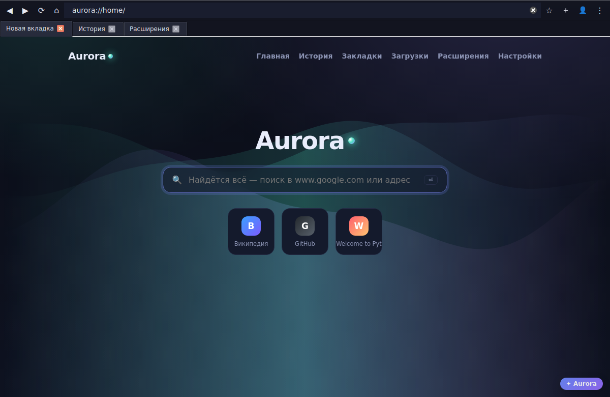

# Aurora — настоящий браузер (Chromium / QtWebEngine, без Electron)

Aurora — это реальный браузер на движке **Chromium** через **QtWebEngine** (не Electron).
Он открывает любые сайты, поддерживает вкладки, историю, закладки, загрузки,
расширения из файлов, несколько профилей и синхронизацию **твоей** истории между
**твоими** устройствами через Google.



## Запуск

```bash
cd browser
pip install -r requirements.txt      # PyQt6 + WebEngine (+ google-* для синхронизации)
python run.py                        # запустить браузер
python run.py https://python.org     # запустить и сразу открыть адрес
```

Все данные хранятся локально в `~/.aurora/` (историю можно смотреть, добавлять и удалять
прямо в браузере на странице `aurora://history`).

> Запуск от root (например, в контейнере) автоматически добавляет `--no-sandbox`.

## Что уже работает

| Возможность | Где |
|---|---|
| 🌐 Реальный веб-движок Chromium | любой сайт |
| 🗂 Вкладки: открыть, закрыть, перетащить, `Ctrl+T/W/Tab` | верхняя панель |
| 🔎 Умная адресная строка (поиск или адрес) | тулбар |
| 🔁 Назад / вперёд / обновить / домой | тулбар |
| 🕘 История: смотреть, искать, **добавлять**, **удалять**, очистить | `aurora://history` |
| ⭐ Закладки (☆ в адресной строке) | `aurora://bookmarks` |
| ⬇️ Менеджер загрузок | `aurora://downloads` |
| 📖 Режим чтения — чистый текст статьи, время чтения, размер шрифта (F9) | кнопка 📖 |
| 🧩 Расширения из файлов (JS/CSS через manifest.json) | `aurora://extensions` |
| 👤 Несколько профилей + окно инкогнито | кнопка 👤 |
| 🔄 Синхронизация истории/закладок через Google Drive | `aurora://settings` |
| 🎨 Тёмная / светлая тема | `aurora://settings` |
| 🔍 Поиск по странице (`Ctrl+F`) | панель поиска |
| 🔒 Простой блокировщик рекламы, Do Not Track | `aurora://settings` |
| 🔎 Масштаб `Ctrl + / − / 0`, печать | меню ⋮ |

### Горячие клавиши

`Ctrl+T` новая вкладка · `Ctrl+W` закрыть · `Ctrl+L` адрес · `Ctrl+R`/`F5` обновить ·
`Ctrl+F` поиск · `F9` режим чтения · `Ctrl+D` закладка · `Ctrl+H` история · `Ctrl+J` загрузки ·
`Ctrl+N` новое окно · `Ctrl+Shift+N` инкогнито · `Ctrl+= / − / 0` масштаб.

## Расширения из файлов

Настоящие Chrome-расширения из Web Store (`.crx`) движок QtWebEngine запускать **не умеет**
— это ограничение движка (так же у Tauri и любого не-Chromium-форка). Поэтому Aurora
использует свой открытый формат в стиле userscript/userstyle:

```
my-extension/
├── manifest.json
├── script.js      (необязательно)
└── style.css      (необязательно)
```

`manifest.json`:
```json
{
  "name": "Моё расширение",
  "version": "1.0",
  "description": "Что делает",
  "matches": ["*://*/*"],
  "js": ["script.js"],
  "css": ["style.css"],
  "run_at": "document_end"
}
```

Установить: `aurora://extensions` → «Установить из файла» (папка с `manifest.json` или `.zip`).
В комплекте два примера: **Hello World** (JS-бейдж) и **Reader Dark** (тёмный режим, по умолчанию выкл).

## Синхронизация через Google

Синхронизируется **только твоя** история и закладки, между **твоими** устройствами,
и только после явного входа. Чужие данные не собираются — это не слежка.

1. Google Cloud Console → включить **Google Drive API**.
2. Создать OAuth-клиент **Desktop app**, скачать `client_secret.json`.
3. Положить его в `~/.aurora/google_client_secret.json`.
4. В браузере: `aurora://settings` → «Войти через Google».

Данные лежат в скрытой служебной папке твоего Google Drive (`appDataFolder`),
доступной только этому приложению.

## Архитектура

```
browser/
├── run.py                 точка входа (регистрация scheme, тема, запуск)
├── aurora/
│   ├── app.py             оркестратор: профили, окна, синхронизация, блокировщик
│   ├── window.py          главное окно: вкладки, тулбар, меню, поиск, загрузки
│   ├── tab.py             вкладка (QWebEngineView) + логика истории
│   ├── pages.py           внутренние страницы aurora:// (история, настройки, …)
│   ├── extensions.py      загрузчик расширений из файлов
│   ├── database.py        SQLite: история, закладки, загрузки
│   ├── sync.py            Google Drive синхронизация
│   └── config.py          настройки и пути
└── extensions/            примеры расширений
```

## Идеи для развития (можно добавлять дальше)

Группы вкладок и вертикальные вкладки, менеджер паролей,
автозаполнение форм, жесты мышью, screenshot всей страницы, встроенный PDF-просмотр,
перевод страниц, картинка-в-картинке для видео, ночной таймер, менеджер сессий,
«отправить вкладку на другое устройство», подсказки поиска на лету, история загрузок
с возобновлением, контейнеры-вкладки (изоляция cookies), родительский контроль,
статистика времени на сайтах, быстрые команды (`Ctrl+K`), закреплённые вкладки,
пользовательские поисковики по ключевым словам, импорт/экспорт закладок (HTML),
темы оформления, RSS-читалка, встроенные заметки, режим чтения вслух (TTS).
